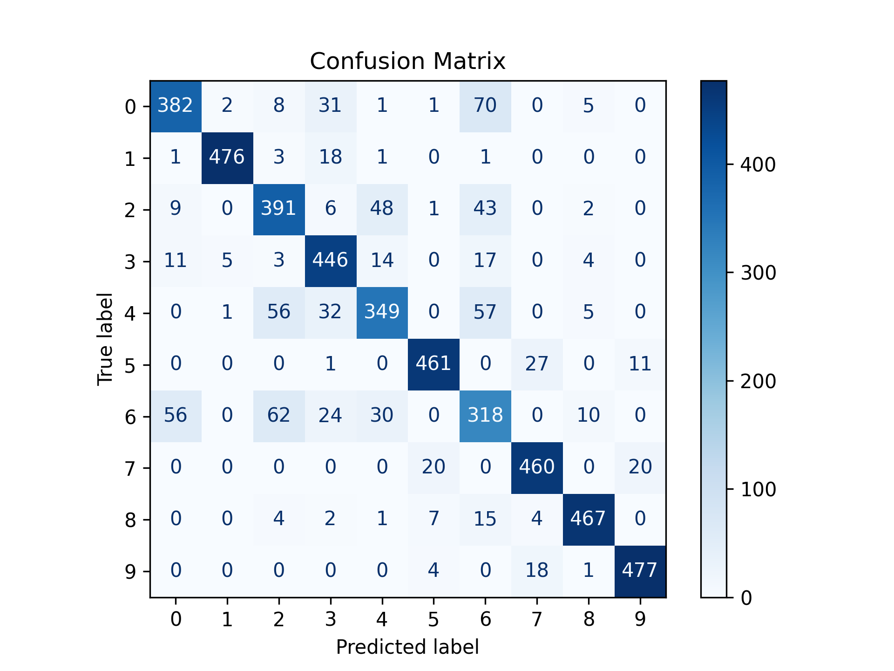
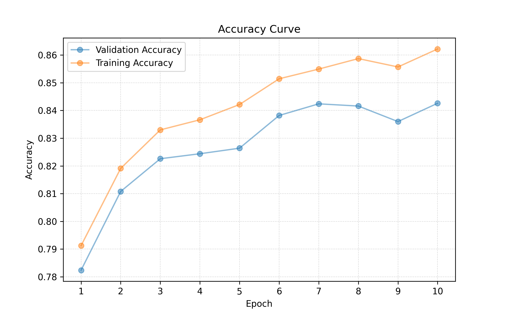
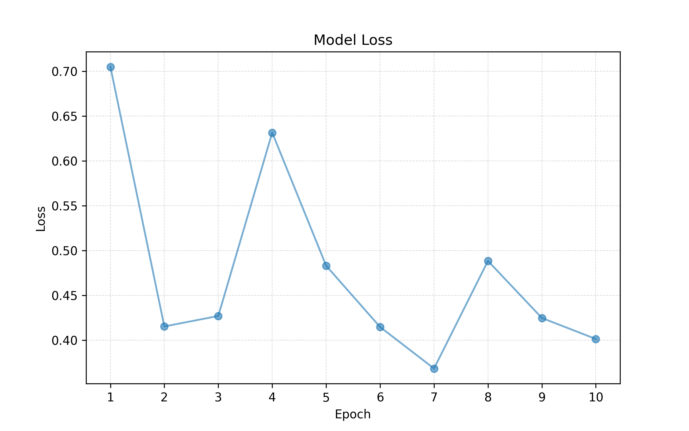

# Neural Network from Scratch — Fashion-MNIST and MNIST Digit Classification

A fully parametric multilayer perceptron (MLP) implemented from scratch using only NumPy — no high-level deep learning frameworks. Built to show fundamental understanding of the theory behind Neural Networks: forward propagation, backpropagation, and gradient-based optimization.

## Overview

This project implements a configurable deep neural network , trained and evaluated on the Fashion-MNIST and MNIST handwritten digit dataset. The current configuration (784 → 512 → 128 → 10) achieves **95% accuracy** on the MNIST test set and **85% accuracy** on the Fashion-MNIST test set.

## Architecture

- **Network:** Fully parametric `Neural Net` class — number of layers and layer sizes are configurable; current run uses `784 → 512 → 128 → 10`
- **Activations:** Parametric activation functions; Currently using Leaky ReLU (hidden layers) and  Softmax (output layer)
- **Loss function:** Cross-entropy
- **Optimizer:** Mini-batch plain gradient descent
- **Hyperparameters:** 10 epochs, learning rate = 0.005

## Implementation Details

Built with two core classes:
- **`Layer`** — handles the linear transformation and activation for a single layer, including forward pass and gradient computation for backpropagation
- **`NeuralNetwork`** — composes layers into a full network, manages forward propagation, backpropagation, and mini-batch gradient descent training. The above are encapsulated within a train and predict methods. An internal Evaluation method is also implemented, facilitating evaluation of the model.

## Notebook Structure

The project is organized into three sections within a single notebook:
1. **Dataset Handling** — downloading, formatting, exploration, and visualization of the MNIST datasets
2. **Model Implemention** — implementation of the `Layer` and `NeuralNetwork` classes, and model training on the different datasets 
3. **Evaluation** — model evaluation on the test set (loss curve, accuracy curve and confusion matrix), including a single-instance prediction tool to test individual test set samples interactively

## Results

- **Fashion-MNIST Test accuracy:** ~85%

  

  

  

<!-- <table align="center">
  <tr>
    <td></td>
    <td></td>
  </tr>
</table> -->
<!-- 

 -->
- **MNIST (plain) Test accuracy:** ~95%

## How to Run

The project was created by using `python 3.13.2`
1. Clone the repository
2. Install dependencies: `pip install -r requirements.txt`
3. Open `notebook.ipynb` and run cells sequentially

## Motivation

This project is an attempt to understand the fundamental concepts of deep neural networks by implementing an MLP from scratch. Learning how neural networks work first hand is an essential skill in today's market where neural networks dictate everything.